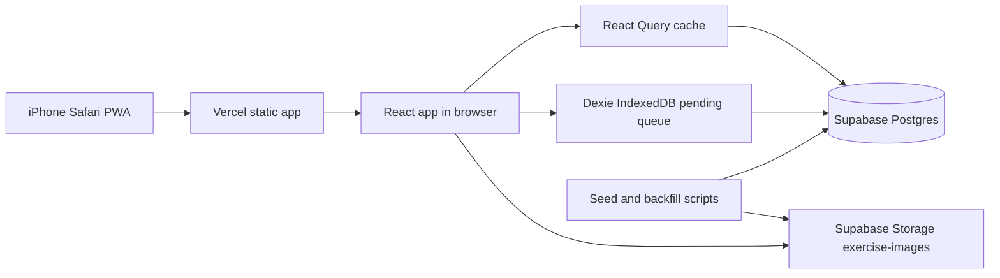

# Deployment

Deploy the **Lift** PWA with Vercel for the web app and Supabase for gym database, storage, and seed data. (Local diary: weight/meals/walks currently live in browser Zustand until synced.)

## Environment Variables
| Variable | Required | Where | Purpose |
|----------|----------|-------|---------|
| `VITE_SUPABASE_URL` | Yes | Local `.env.local`, Vercel | Browser-safe Supabase project URL. |
| `VITE_SUPABASE_ANON_KEY` | Yes | Local `.env.local`, Vercel | Browser-safe anon key. |
| `SUPABASE_SERVICE_ROLE_KEY` | Scripts only | Local shell or secure CI secret | Seed and backfill scripts only. Never expose to browser code. |
| `SUPABASE_PROJECT_REF` | Admin only | Local shell or CI | Supabase CLI/project targeting. |
| `VERCEL_PROJECT_ID` | CI optional | Vercel/GitHub secrets | Links CLI deploys to the project. |
| `VERCEL_ORG_ID` | CI optional | Vercel/GitHub secrets | Links CLI deploys to the team/account. |

## Infrastructure


## Quick Start
1. Install dependencies.

   ```bash
   pnpm install
   ```

2. Create `.env.local` with browser-safe Supabase values.

   ```bash
   VITE_SUPABASE_URL=https://<project-ref>.supabase.co
   VITE_SUPABASE_ANON_KEY=<anon-key>
   ```

3. Run the app locally.

   ```bash
   pnpm dev
   ```

4. Build before deploying.

   ```bash
   pnpm build
   ```

5. Deploy from `main` through Vercel auto-deploy.

## Supabase Setup
1. Create a Supabase project.
2. Apply all migrations in `supabase/migrations/` in order (`supabase db push` once linked — `supabase/config.toml` needs a `project_id` key, not the old `name` key, or current CLI versions reject it).
3. Create public-read Storage bucket `exercise-images`.
4. Set local script-only secrets in the shell when running seed or backfill.
5. Verify `exercises`, `sessions`, `sets`, `body_weight_logs`, `goals`, `templates`, and `template_exercises` exist before running the app.
6. Apply `0005_cardio_set_fields.sql` so `sets` allows nullable `weight_lb`/`reps` and has `level` / `speed` / `duration_sec` / `calories`. Until it is applied, the client still logs cardio locally and queues cardio-only upserts; lift sync continues to work.

## Supabase Edge Function secrets
LLM keys belong in **Supabase secrets**, not Postgres tables and not `VITE_*` (browser) env.

1. In `.env.local`, set `VITE_SUPABASE_URL`, `VITE_SUPABASE_ANON_KEY`, and **`ANTHROPIC_API_KEY`** (preferred). Optionally also `GROQ_API_KEY` as fallback.
2. Log in and link your project: `npx supabase login` then `npx supabase link --project-ref <ref>`.
3. Push secrets to Supabase:

   ```bash
   pnpm supabase:secrets
   ```

4. Deploy the parser function:

   ```bash
   pnpm supabase:deploy-functions
   ```

Or manually in the Supabase dashboard: **Project Settings → Edge Functions → Secrets** → add `ANTHROPIC_API_KEY` (and optionally `GROQ_API_KEY`).

`parse-exercise-log` uses **Claude Haiku (`claude-haiku-4-5`)** first for messy set logs (number words, broken English), then Groq if Anthropic is unset/fails. The client commits the draft with Zod — no Anthropic key in the browser.

`VITE_SUPABASE_URL` and `VITE_SUPABASE_ANON_KEY` are copied **from** Supabase API settings into Vercel/`.env.local`. They are not stored back into Supabase.

## Vercel Setup
1. Import the GitHub repo into Vercel.
2. Set framework preset to Vite.
3. Set build command to `pnpm build`.
4. Set output directory to `dist`.
5. Add `VITE_SUPABASE_URL` and `VITE_SUPABASE_ANON_KEY`.
6. Enable auto-deploy from `main`.
7. Production URL: **https://weighttrackerdv.vercel.app** (confirm in Vercel project domains if renamed).

## Runbook
| Symptom | Check | Fix |
|---------|-------|-----|
| Blank app after deploy | Browser console and Vercel build output | Confirm `pnpm build` passes and entry file matches Vite config. |
| Supabase requests fail | Network tab and env vars | Verify Vercel has `VITE_SUPABASE_URL` and `VITE_SUPABASE_ANON_KEY`. |
| Images do not load | Storage bucket and `image_url` values | Confirm bucket is public-read and paths use `exercise-images/<slug>.jpg`. |
| Offline writes do not sync | Dexie pending table and online events | Confirm queued payloads have UUIDs and drain on `online` or `visibilitychange`. |
| PR badges missing | `sets.is_pr` value after insert | Verify trigger exists and warmup sets are excluded. |
| PWA install prompt missing | Manifest and icons | Confirm `public/manifest.webmanifest`, icons, and theme-color metadata exist. |

## Debugging Guide
- Reproduce locally with `pnpm dev` before changing deployment settings.
- Build locally with `pnpm build` before pushing release fixes.
- Inspect Supabase table rows directly when UI state and persisted state disagree.
- Clear IndexedDB only after exporting pending writes or confirming the queue is empty.
- Treat service-role key exposure as a release blocker. Rotate the key if it appears in logs, client code, screenshots, or committed files.
