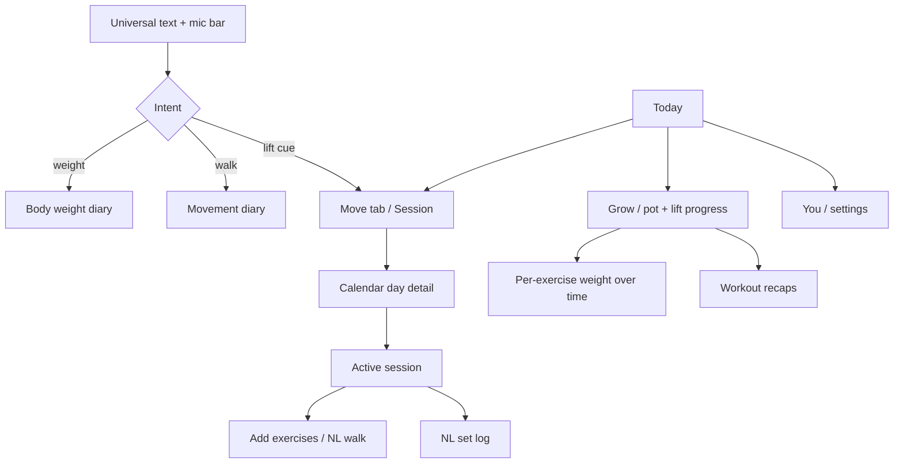

# Aloo PWA

Mobile-first personal health PWA for **Dhruva** — body weight, walks/cardio, and gym sessions in one app. Food, meal, macro, and calorie logging are archived for a later pass. Built with Vite + React + TypeScript, Supabase-backed where wired, local-first Zustand for diary/UI, installable from iPhone Safari.

**Brand:** Aloo · **Theme:** soft gold + white · **Progress metaphor:** pot of gold that fills with consistency

## Product Flow

## Stack
| Layer | Technology |
|-------|------------|
| App | Vite 5, React 18, TypeScript |
| Data | Supabase Postgres/Storage (gym path) + local diary Zustand |
| Cache/state | TanStack React Query, Zustand |
| Offline | Dexie queue for Supabase writes, vite-plugin-pwa |
| UI | Tailwind, EB Garamond, DM Mono |
| Charts / motion | Recharts, framer-motion |
| Voice | Web Speech API (Groq Whisper queued for iPhone PWA) |

## Routes
| Route | Purpose |
|-------|---------|
| `/` | Today — weight, training summary, pot of gold |
| `/move` | Gym home — calendar, day detail, walks secondary |
| `/grow` | Pot of gold + lift progress charts + gym feed |
| `/you` | Settings / export |
| `/session/new`, `/session/:id` | Active workout; NL walks + set logging |
| `/exercises`, `/exercises/new`, `/exercises/:slug` | Library |
| `/goals` | Editable daily intentions |
| `/log` | Redirect → `/move` |
| `/history` | Redirect → `/grow` |
| `/progress`, `/calendar`, `/settings`, `/onboarding` | Redirects (`/calendar` → `/move`) |

## Local-first diary (not yet Supabase tables)
Persisted under `aloo-diary-v1` / `aloo-ui-v1`:
- Body weight logs (seeded ~169 lb for Dhruva)
- Movements from “walking 30 min”, etc.
- Intentions (add / toggle / remove)
- `goldDays` for pot-of-gold growth

Food archive lives under `archive/food/` and is not imported by the active app.

## Scripts
| Command | Purpose |
|---------|---------|
| `pnpm dev` | Local Vite |
| `pnpm test` | Vitest |
| `pnpm build` | Typecheck + production build |
| `pnpm preview` | Preview `dist/` |
| `pnpm seed` | Seed Supabase from board JSON |
| `pnpm backfill:images` | Image backfill |

## Environment
| Variable | Required | Purpose |
|----------|----------|---------|
| `VITE_SUPABASE_URL` | Yes (gym sync) | Browser Supabase URL |
| `VITE_SUPABASE_ANON_KEY` | Yes (gym sync) | Browser anon key |
| `SUPABASE_SERVICE_ROLE_KEY` | Scripts only | Seed/backfill |

## Documentation
| File | Purpose |
|------|---------|
| `CLAUDE.md` / `AGENTS.md` | Agent workflow + contracts |
| `web/CLAUDE.md` | Web subsystem |
| `db/CLAUDE.md` | Schema / storage |
| `HANDOFF.md` | Cross-agent handoff (current) |
| `DEPLOYMENT.md` | Vercel + Supabase |
| `decisions/` | ADRs (garden→Aloo gold, voice, context saves) |
| `wiki/README.md` | Long-form notes index |

## Current Status (Jul 2026)
Current active shape: Aloo gold shell, pot of gold, universal NL/voice bar, walks/weight local diary, editable intentions, real lift charts, and gym sessions that sync to Supabase when configured. Food, meal, macro, and calorie UI is archived under `archive/food/`.
