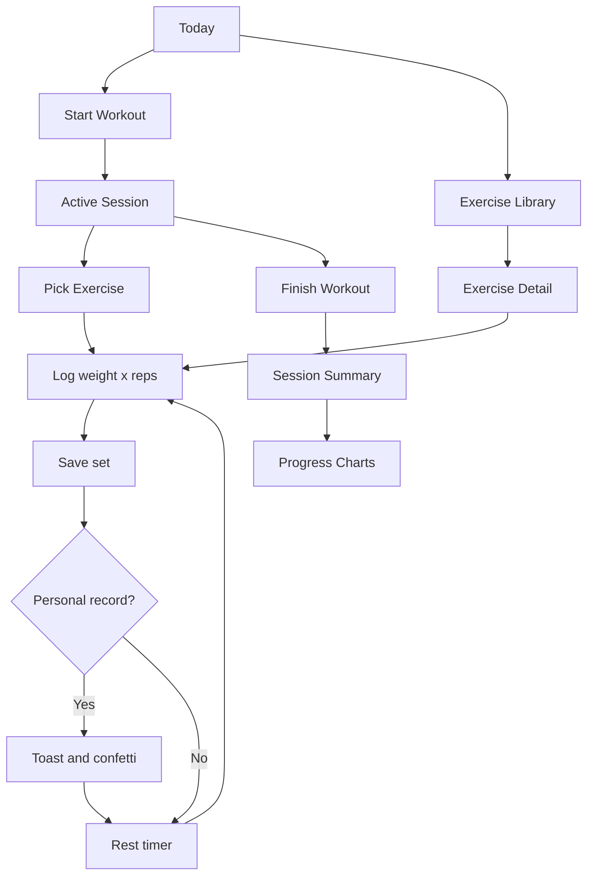

# Weight Tracker PWA

Mobile-first gym tracker for logging sets, browsing exercises, and watching long-term progress. The app is planned as a Vite React PWA backed by Supabase, with offline writes through Dexie and install support from iPhone Safari.

## Product Flow


## Key Metrics and Numbers
| Metric | Target |
|--------|--------|
| Touch target size on log path | Minimum 56px height |
| Log path animation | 0ms for weight input, reps buttons, and save-set tap |
| Page transition | 180ms fade and slide |
| Chart draw-in | 400ms |
| Count-up duration | 800ms |
| Confetti duration | About 1.5s |
| Rest timer default | 90s |
| Exercise image precache budget | Up to 20 MB |
| Owner account model | Single hardcoded `USER_ID` |
| Deploy target | Vercel from `main` |

## Stack
| Layer | Technology |
|-------|------------|
| App | Vite, React, TypeScript |
| Data | Supabase Postgres and Storage |
| Cache/state | TanStack React Query, Zustand |
| Offline | Dexie, vite-plugin-pwa |
| UI | Tailwind, shadcn/ui, 21st.dev components |
| Charts and motion | Recharts, framer-motion, canvas-confetti, react-countup |

## Scripts
| Script | Command | Purpose |
|--------|---------|---------|
| `dev` | `vite` | Start local development server. |
| `build` | `tsc && vite build` | Type-check and build production assets. |
| `preview` | `vite preview` | Preview built assets locally. |
| `test` | `vitest run` | Run unit tests. |
| `seed` | `tsx scripts/seed-user-board.ts` | Seed Supabase from the board JSON. |
| `backfill:images` | `tsx scripts/backfill-images.ts` | Backfill exercise images from Free Exercise DB. |

Run scripts with pnpm:

```bash
pnpm dev
pnpm test
pnpm build
pnpm preview
```

## Environment
| Variable | Required | Purpose |
|----------|----------|---------|
| `VITE_SUPABASE_URL` | Yes | Browser-safe Supabase URL. |
| `VITE_SUPABASE_ANON_KEY` | Yes | Browser-safe Supabase anon key. |
| `SUPABASE_SERVICE_ROLE_KEY` | Scripts only | Seed and backfill scripts. |

## Routes
| Route | Purpose |
|-------|---------|
| `/` | Today dashboard. |
| `/session/new` | Create a session and redirect to active logging. |
| `/session/:id` | Active session logging. |
| `/exercises` | Searchable library. |
| `/exercises/new` | Create exercise with optional camera photo. |
| `/exercises/:slug` | Exercise detail, PR, history, chart. |
| `/progress` | Charts, body weight, weekly volume, muscle rings. |
| `/history` | Session list. |
| `/history/:sessionId` | Historical session recap. |
| `/goals` | Goal checklist. |
| `/settings` | Units, rest timer, export, install-PWA CTA. |

## Documentation
| File | Purpose |
|------|---------|
| `CLAUDE.md` | Root agent workflow and project contract. |
| `AGENTS.md` | Codex mirror of root workflow plus agent stubs. |
| `web/CLAUDE.md` | Web subsystem patterns and constraints. |
| `db/CLAUDE.md` | Supabase, storage, seed, and offline contract rules. |
| `HANDOFF.md` | Cross-agent integration handoff. |
| `DEPLOYMENT.md` | Vercel and Supabase runbook. |
| `wiki/README.md` | Project wiki index. |
| `decisions/README.md` | Decision record index. |

## Current Status
The repository contains the first functional React PWA slice: local-first session logging, exercise library, goal checklist, progress charts, Supabase migration, seed scripts, and PWA config. Supabase credentials are still required before running seed/backfill against a real project.
